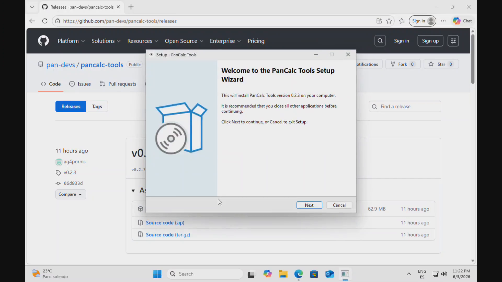

# PanCalc Tools

Package manager, file converter, and developer toolkit for **Casio Prizm** calculators
(fx-CG50, fx-CG100, and compatible models).

Part of the [Pan Devs](https://github.com/pan-devs) project.

---
[](https://deepwiki.com/pan-devs/pancalc-tools)

## 📖 Quick Start (for Windows — recommended)

Download the `PanCalc-Tools-Setup-XX.XX.XX.exe` file from the latest [release](https://github.com/pan-devs/pancalc-tools/releases) and double-click it to install PanCalc Tools.

> The installer is **fully self-contained**: it includes everything the app needs
> (file conversion, PDF/DOCX support and GnuPG signature verification), so you
> don't need to install Python, GnuPG or anything else. Just install and open the
> PanCalc Tools window.

Windows may warn you that the file could be dangerous ("Windows protected your PC"). This is normal for a brand-new program — click on **More info** → **Run anyway**. If it appears in the download bar as "not commonly downloaded", click the three dots, choose **Keep**, then **Keep anyway**. The installation will continue.

Then, accept that it can change your settings/device (when the pop-up window appears, click **Yes**), and the installer will finish. Leave the "Create a desktop shortcut" box checked to open it easily later.

And no worries, it is safe.

_Click the image below to watch the tutorial (it will be downloaded)_


[](https://github.com/pan-devs/pancalc-tools/raw/refs/heads/main/QuickInstall-Win-TUI-small.mp4)


> 💡 **Tips:**
> - Use your mouse/trackpad and click to interact.
> - Questions? Ask the specialized AI at https://deepwiki.com/pan-devs/pancalc-tools
> - Press **Ctrl+S** to open the command palette.
> - Press **Esc** to return to the home screen.
> - Use **↑** and **↓** to move between items.
> - Press **Space** to select/deselect an item.

---

## Features

- **📦 Add-in management** — Install, remove, and verify add-ins from the
  [pan-devs/pancalc-registry](https://github.com/pan-devs/pancalc-registry)
  with automatic SHA256 + PGP signature verification.
- **🎮 Games / Emulators** — Install NES, GB, GBA, SMS, GG ROMs via emulators
  (Nesizm, etc.). Games tracked in the same tool alongside add-ins.
- **📁 Local Library** — Import your own `.g3a`/`.g3e` add-ins or game ROMs
  from local files. No registry needed. Files copied for safekeeping.
- **🖼️ File conversion** — Convert images (PNG, JPG, BMP, GIF, TIFF, WebP) and
  documents (PDF, DOCX) to Casio `.g3p` photo format or plain text.
- **📤 Push to calculator** — Copy converted files to `pthings/fotos/`
  (`.g3p`) or `pthings/textos/` (`.txt`) automatically.
- **🔍 Calculator browsing** — Browse the full calculator filesystem, identify
  known add-ins, and inspect storage usage.
- **🗑️ Orphan removal** — Detects files not in any registry and removes them,
  including companion save files (`.sav`, `.srm`, `.state`).
- **🔐 Cryptographic verification** — SHA256 checksums on every download and
  PGP signature verification against the official Pan Devs key (auto-downloaded,
  no manual setup required).
- **🖥️ Graphical app** — The main, end-user **GUI** (built with Flet). A
  **Terminal UI** (Textual) and **CLI** (click) are also available for
  developers who run the source directly.
- **🔑 PGP key management** — Import, trust, list, and untrust additional keys
  for advanced users.
- **🔁 In-app self-update** — Checks GitHub Releases on launch and installs new
  versions with a live progress bar and a guided restart flow.

> **Filename Limitations:** The Casio calculator cannot read files with spaces
> or non-English characters (accents, special symbols). Files are automatically
> sanitized when pushed (spaces → `_`, accents removed, etc.).
>
> **📄 TXT File Reading:** To view TXT files on your calculator, you need to install the "Utilities" add-in from the registry first. This add-in provides a file viewer for text documents on your Casio calculator (and also a JPEG viewer).
---


## For developers and advanced users (CLI / TUI / other OS)

> ⚠️ **End users don't need this section.** If you installed the GUI from the
> release above, everything is already set up. The instructions below are for
> developers who want to run the **CLI/TUI** directly with Python on the command
> line instead of the packaged GUI.

### 1. Install dependencies

Before installing PanCalc Tools, you need a few things depending on your OS.

#### 🪟 Windows

**Python 3.10+**

1. Go to [python.org](https://www.python.org/downloads/) and download the latest **Python 3** installer.
2. **Important:** check the box **"Add Python to PATH"** at the bottom of the installer screen before clicking Install.
3. Open **Command Prompt** (search "cmd" in the Start menu).
4. Type `python --version` to confirm.

**Microsoft Visual C++ Redistributable** — needed for PDF/DOCX conversion (pymupdf):

- 64-bit (most users): https://aka.ms/vs/17/release/vc_redist.x64.exe
- 32-bit Python: https://aka.ms/vs/17/release/vc_redist.x86.exe

Download and install, then restart Command Prompt.

**Gpg4win** — needed for add-in signature verification:

1. Download from [gpg4win.org](https://gpg4win.org)
2. Run the installer (default options are fine).
3. Confirm it works: open Command Prompt and type `gpg --version`.

---

#### 🍎 macOS

**Python 3.10+**

1. Go to [python.org](https://www.python.org/downloads/) and download the latest **Python 3** installer.
2. Open the downloaded file and follow the steps.
3. Open the **Terminal** app (Cmd+Space → "Terminal").
4. Type `python3 --version` to confirm.

**Xcode Command Line Tools** — needed for some dependencies (pymupdf):

```bash
xcode-select --install
```

> If you see "already installed", you're good.

**GnuPG** — needed for add-in signature verification. Install one of:

- **GPG Suite** (recommended, includes GUI): [gpgtools.org](https://gpgtools.org)
- **Homebrew** (if you use it): `brew install gnupg`


---

#### 🐧 Linux

**Python 3.10+** — open a terminal and check:

```bash
python3 --version
```

If you see `Python 3.10` or higher, you're ready. If not:

- **Ubuntu / Debian / Mint:**
  ```bash
  sudo apt install python3 python3-pip
  ```
- **Arch / Manjaro:**
  ```bash
  sudo pacman -S python python-pip
  ```
- **Fedora:**
  ```bash
  sudo dnf install python3 python3-pip
  ```

**GnuPG** — needed for add-in signature verification. Check if it's installed:

```bash
gpg --version
```

If not found:

- **Ubuntu / Debian / Mint:** `sudo apt install gnupg`
- **Arch / Manjaro:** `sudo pacman -S gnupg`
- **Fedora:** `sudo dnf install gnupg2`


---

### 2. Install PanCalc Tools

Open a terminal (search for "cmd" in Windows) and run:

```bash
python -m pip install "pancalc-tools[gui]"
```

> `[gui]` installs the extra dependencies needed for the **graphical interface**
> (Flet). Omit `[gui]` if you only want the command-line / terminal interfaces.

> On Linux/macOS, use `python3 -m pip` if `python` is not found.

**Windows only** — also install `pywin32` for automatic calculator eject:

```bash
python -m pip install "pancalc-tools[windows]"
```

> **Linux users:** if you get an `externally-managed-environment` error, use:
> ```bash
> python -m pip install --user "pancalc-tools[gui]"
> ```

---

### 3. Launch the program

Open a terminal (or Command Prompt on Windows) and type:

```bash
pcalc
```

The interactive menu will open.

> **⚠️ Windows — if `pcalc` is not recognized:**
> Python's Scripts directory may not be in your PATH.
> Add `%APPDATA%\Python\Python3xx\Scripts` to your PATH
> (replace `3xx` with your Python version, e.g. `Python314`),
> or use the fallback command:
> ```bash
> python -m pcalc
> ```

---

### 4. Connect your calculator

#### 🪟 Windows

1. Turn on your Casio calculator.
2. Press **F1** (USB mass storage mode).
3. Connect it with a USB cable.
4. It will appear as a new drive in **File Explorer** (e.g. `D:\` or `E:\`).
   PanCalc Tools will detect it automatically.

#### 🍎 macOS

1. Turn on your Casio calculator.
2. Press **F1** (USB mass storage mode).
3. Connect it with a USB cable.
4. It will appear as a drive in **Finder** and be detected automatically.

#### 🐧 Linux

1. Turn on your Casio calculator.
2. Press **F1** (USB mass storage mode).
3. Connect it with a USB cable.
4. PanCalc Tools will detect it automatically.

> If the calculator is not detected, try running `udisksctl mount -b /dev/sdb1`
> (replace `sdb1` with the correct device — check with `lsblk`).

---

After connecting your calculator, navigate to the **Catch** option in the
pcalc interface to browse its filesystem.


---

## Table of Contents

- [Installation](#installation)
- [Terminal UI (TUI)](#terminal-ui)
- [CLI Reference](#cli-reference)
  - [Registry & Search](#pcalc-list--search--info)
  - [Install](#pcalc-install)
  - [Remove](#pcalc-remove--rm)
  - [Local Library](#pcalc-local)
  - [Games](#pcalc-games)
  - [Verify](#pcalc-verify)
  - [Convert & Push](#pcalc-convert--convpush)
  - [Eject & Catch](#pcalc-eject--catch)
  - [PGP Keys](#pgp-keys)
  - [Configuration](#configuration)
- [Local Library](LOCAL_LIBRARY.md)
- [Games / Emulators](GAMES.md)
- [Orphan Removal](ORPHAN_REMOVAL.md)
- [Architecture](ARCHITECTURE.md)
- [Changelog](CHANGELOG.md)
- [License & Contributing](#license)

---

## Installation

### Requirements

- **Python 3.10+**
- A **Casio Prizm** calculator connected via USB in **mass storage mode** (F1)
- **GnuPG** (gpg) — for PGP signature verification (see per-OS instructions below)

### From PyPI

```bash
python -m pip install pancalc-tools
```

On **Windows**, also install `pywin32` for automatic drive detection and eject:

```bash
python -m pip install pancalc-tools[windows]
```

### From source

```bash
git clone https://github.com/pan-devs/pancalc-tools.git
cd pancalc-tools
pip install -e .
```

### Installing GnuPG

#### 🪟 Windows

> ✅ **The released installer already bundles a standalone GnuPG** inside the app,
> so end users don't need to install anything. The steps below are only for
> developers running from source or via pip.

If installing via pip (not the release installer):

1. Download **GnuPG binary** from [gnupg.org/download](https://www.gnupg.org/download/)
2. Extract and place `gpg.exe` in your `PATH` (e.g. `C:\Program Files\GnuPG\bin\`)
3. Or run the Gpg4win installer with only the GnuPG component selected

#### 🍎 macOS

```bash
brew install gnupg          # Homebrew
# or install GPG Suite: https://gpgtools.org
```

#### 🐧 Linux

```bash
# Debian / Ubuntu / Mint
sudo apt install gnupg

# Arch / Manjaro
sudo pacman -S gnupg

# Fedora
sudo dnf install gnupg2
```

### Launch

```bash
pcalc
```

> **Windows:** If `pcalc` is not recognized, add `%APPDATA%\Python\Python3xx\Scripts`
> to your PATH, or use `python -m pcalc`.

### Connect calculator

1. Turn on your Casio calculator
2. Press **F1** (USB mass storage mode)
3. Connect via USB
4. PanCalc Tools detects it automatically

> **Linux:** If not detected, try `udisksctl mount -b /dev/sdb1`
> (check device with `lsblk`).

---

## Terminal UI

```bash
pcalc
```

Opens the interactive TUI with a sidebar for navigation:

| Button                       | Action                                    |
|------------------------------|-------------------------------------------|
| 🏠 Home                      | Dashboard with calculator info & help     |
| 📂 Catch                     | Browse calculator filesystem              |
| 📥 Install                   | Install add-ins from the registry + local |
| 🎮 Games                     | Install/import/remove emulator game ROMs  |
| 🗑️ Remove                    | Uninstall add-ins, games, orphans, files  |
| 🔄 Convert                   | Convert images/docs to G3P/TXT            |
| 📤 Push                      | Copy converted files to calculator        |
| ✅ Verify                    | Check SHA256 of installed add-ins         |
| 📋 Registry                  | Browse add-ins + games with details view  |
| 🔑 PGP Keys                  | Manage cryptographic keys                 |

Additional buttons in specific screens:

| Screen   | Button                | Action                              |
|----------|-----------------------|-------------------------------------|
| Install  | 📁 Add Add-in File    | Import local `.g3a`/`.g3e` to lib   |
| Install  | 🗑️ Remove Local      | Remove selected local library items  |
| Games    | 📁 Add Game File      | Import local ROM to library          |
| Games    | 🗑️ Remove Local      | Remove selected local library items  |
| Home     | 🔄 Update Registry   | Force-refresh from GitHub            |
| Home     | ⏏️ Eject             | Safely unmount calculator            |

---

## CLI Reference

### `pcalc list` / `search` / `info`

```bash
pcalc list                    # List all add-ins in the registry
pcalc search calculator       # Search by keyword
pcalc info khicas             # Show add-in details
```

### `pcalc install`

```bash
pcalc install khicas utilities       # Install multiple add-ins
pcalc install --yes khicas           # Skip confirmation
pcalc install --overwrite khicas     # Overwrite existing files
```

### `pcalc remove` / `rm`

```bash
pcalc remove khicas                  # By add-in ID (scans registry)
pcalc rm pthings/fotos/photo.g3p     # By relative path
```

### `pcalc local`

Manage your local library of user-imported files.

```bash
pcalc local import myaddin.g3a       # Import add-in (copied to library)
pcalc local import game.nes          # Import game ROM
pcalc local import --yes file.gba    # Skip format validation
pcalc local remove <id>              # Remove from library (entry + file)
pcalc local list                     # List all locally imported items
```

See [LOCAL_LIBRARY.md](LOCAL_LIBRARY.md) for details.

### `pcalc games`

Install, import, and remove emulator game ROMs.

```bash
pcalc games import game.nes          # Import ROM to local library
pcalc games install <id>             # Install ROM to calculator
pcalc games remove <id>              # Remove ROM from local library
pcalc games list                     # List available games
```

See [GAMES.md](GAMES.md) for details.

### `pcalc verify`

```bash
pcalc verify                        # Verify ALL add-ins on calculator
pcalc verify khicas utilities       # Verify specific add-ins
```

Scans the calculator directly — no local cache needed.

### `pcalc convert` / `convpush`

```bash
pcalc convert photo.png             # Image → G3P
pcalc convert doc.pdf               # PDF → interactive prompt
pcalc convert --g3p doc.pdf         # PDF → G3P only
pcalc convert --txt doc.pdf         # PDF → TXT only
pcalc convert --both doc.pdf        # PDF → G3P + TXT
pcalc convpush                      # Copy converted files to calculator
```

Files go to `pthings/fotos/` (`.g3p`) and `pthings/textos/` (`.txt`).
Filenames are sanitized automatically.

### `pcalc eject` / `catch`

```bash
pcalc eject                   # Safely unmount calculator
pcalc catch                   # Browse calculator filesystem
pcalc calc                    # Alias for catch
```

### PGP Keys

```bash
pcalc import-key mykey.asc
pcalc list-keys
pcalc trust-key <fingerprint>
pcalc untrust-key <fingerprint>
```

---

## Input / Output Layout

```
pancalc-tools/
├── convert/            ← Drop files here for conversion
│   ├── images/         (PNG, JPG, BMP, GIF, TIFF, WebP)
│   └── documents/      (PDF, DOCX)
├── converted/          ← Converted files appear here
│   ├── g3p/            (.g3p files)
│   └── txt/            (.txt files)
```

## Data Locations

| Data                  | Location                                              |
|-----------------------|-------------------------------------------------------|
| Library (local files) | `~/.local/share/pancalc/library/files/`               |
| Library index         | `~/.local/share/pancalc/library/library.json`         |
| Installed DB          | `~/.local/share/pancalc/installed.json`               |
| Registry cache        | `~/.cache/pancalc/`                                   |

---

## Security

### SHA256 Verification

Every add-in / game in the registry includes a `sha256` field. The installer
computes the SHA256 of every downloaded file and aborts on mismatch.
Local library files also have SHA256 — verified on install.

### PGP Signatures

All official registry files are signed with the **Pan Devs PGP key**.
The key is **auto-downloaded** on first use — no manual setup required.

- Fingerprint: `C7AD 9689 E894 B261 7EAB  CFE2 1A37 0E1B 68A1 94A8`
- Algorithm: Ed25519
- Public key: [`pandevs.asc`](https://github.com/pan-devs/pancalc-registry/blob/main/pandevs.asc)

Local library files skip PGP (they came from you, no signature needed).

---

## License

**PAN DEVS NON-COMMERCIAL ATTRIBUTION LICENSE v1.0**

- **Non-commercial use** is free with attribution required.
- **Commercial use** requires a separate paid license.
  Contact `pan.devs@proton.me`.
- **AI/ML training** on this code is explicitly prohibited.

See [LICENSE.md](LICENSE.md) for the full text.

## Contributing

Pull requests and issues are welcome. For major changes, please open an
issue first to discuss what you'd like to change.

### Development setup

```bash
git clone https://github.com/pan-devs/pancalc-tools.git
cd pancalc-tools
python -m venv .venv
source .venv/bin/activate
pip install -e ".[dev]"
```

## Links

- **Registry:** https://github.com/pan-devs/pancalc-registry
- **Issues:** https://github.com/pan-devs/pancalc-tools/issues
- **Contact:** pan.devs@proton.me
- **Changelog:** [CHANGELOG.md](CHANGELOG.md)
- **Architecture:** [ARCHITECTURE.md](ARCHITECTURE.md)

## Privacy
PanCalc Tools does not collect, store, or share any personal information.

## AI Assistance

The idea and design are the author's own. The code implementation is supported
by, and in large part written with, AI assistance.
